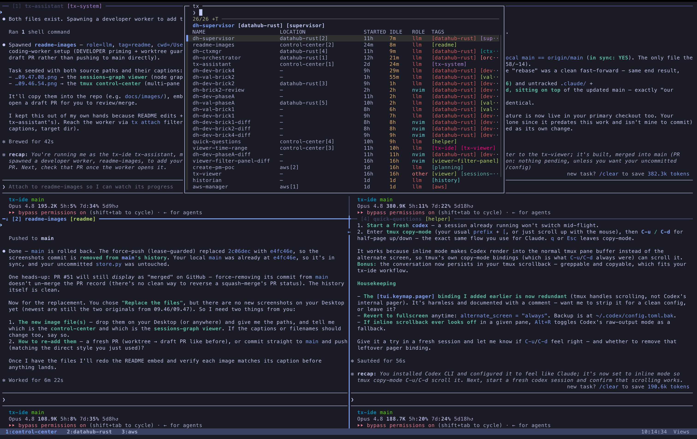

# tx-ide (Rust)

A tmux + Claude Code session controller, rewritten in Rust. One CLI (`tx`) gives every tmux
session a **durable record**, an fzf **picker** to find and attach them, verbs to **spawn**
Claude Code / Codex / Antigravity workers and nvim companions, **chat operations** (fork /
handover / rollover) over the conversations behind a session, a central **history** of every
chat, and a repo/branch/model **statusline**.

This is a drop-in replacement for the Python [tx-ide](https://github.com/wiktordaniec/tx-ide):
same verbs, same output, same `~/.tx-ide` records (schema v6), so an existing install switches
over with its sessions and history intact. It needs no Python. Inside, it is built as
**components** on a small runtime after the *spatiotemporal composability* paradigm (Cordis):
engines and verb groups are components you can switch off in `config.json`, and unloading one
removes exactly what it added.

There is no daemon. State lives in plain JSON records under `$TX_IDE_HOME` (default
`~/.tx-ide`); every read reconciles those records against the live tmux server, and engine hooks
drive each session's state as you work.



## Requirements

- macOS or Linux.
- Rust 1.92+ (`rustup`), to build `tx`.
- `tmux` (3.6+ recommended; 3.5 works) and `fzf` ≥ 0.63. The installer offers to `brew install`
  missing ones.
- `git` (worker worktrees).
- At least one agent engine: Claude Code (`claude`), Codex (`codex`) or Antigravity (`agy`).
- Optional: `nvim` for `tx spawn-nvim` (the repo ships a LazyVim config under `nvim/`).

## Install

```bash
git clone <this-repo> ~/tx-ide-rs
cd ~/tx-ide-rs
cargo build --release
ln -sf ../target/release/tx bin/tx
./install
```

The cloned repo is the code; `$TX_IDE_HOME` holds only state. `./install` asks before each step,
is safe to re-run, and backs up every file it edits (`<file>.bak.<timestamp>`). It:

- links `tx`, `tx-assistant` and the tmux helpers into `~/.local/bin` (make sure it is on `PATH`),
- creates the `$TX_IDE_HOME` skeleton,
- adds a `source-file` line for the tx tmux fragment to `~/.tmux.conf`,
- generates the hook shims under `$TX_IDE_HOME/hooks/` and registers them with every engine CLI
  it finds (`~/.claude/settings.json`, `~/.codex/hooks.json`, …) behind a marker, leaving your
  other hooks alone,
- installs the statusline, and offers to link the bundled nvim config.

Then:

```bash
tx --help    # the commands
tx start     # create the Views home base, warm the tx-assistant, attach
```

To use another home, export it before installing: `TX_IDE_HOME=~/.tx-ide-dev ./install`.

### Updating

```bash
git pull && cargo build --release && ./install
```

`bin/tx` points at `target/release/tx`, so a rebuild is picked up at once; re-running
`./install` refreshes the shims and hooks.

### Switching from the Python tx-ide

Run the Rust `./install` over the existing install. It re-points `~/.local/bin/tx`, the hook
shims, the tmux hook and the statusline at this repo; your records, history and roles in
`~/.tx-ide` are reused as they are. Running agent panes keep going and their hooks now call the
Rust `tx`. Do not run the Python checkout's `./uninstall` first — it deletes `log.jsonl`.

To go back, run the Python checkout's `./install`: it re-points everything the same way.

## Uninstall

```bash
./uninstall               # reverse the install; keep sessions, history, log and role overrides
./uninstall --keep-agent  # keep the Claude hooks, statusline and marker
./uninstall --purge       # also delete sessions/, history/, user-agents/ and log.jsonl
```

## Quick start

```bash
tx start                                              # Views + tx-assistant, then attach
tx spawn auth --tag api --cwd ~/code/app --prompt "Fix the login bug"   # a Claude worker
tx spawn review --tag api --engine codex --effort 4 --cwd ~/code/app    # a Codex worker
tx spawn-nvim notes --tag api --cwd ~/code/app --diff                   # nvim with a diffview
tx ls                                                  # what is running
tx attach                                              # the fzf picker (prefix+t in tmux)
```

Inside tmux: `prefix+t` opens the picker, `prefix+/` sends a line to the tx-assistant,
`prefix+e` edits a session's name and tags, `prefix+X` kills the active pane's session,
`prefix+s` lists sessions with their names and tags, and `C-h/j/k/l` move between panes
(passing through into nvim and nested tmux).

## Commands

`tx` (or `tx --help`) prints the summary. `tx <verb> -h` prints a verb's flags.

| Area | Commands |
|---|---|
| Spawn | `spawn` (worker or shell; `--engine`, `--prompt`, `--model`, `--effort 1-5`, `--role`, `--read-only`), `spawn-nvim`, `spawn-view` |
| Inspect | `ls` (`--json`), `show`, `history`, `chat ls`, `whoami`, `attach` |
| Chat operations | `fork`, `handover`, `rollover`, `resume` |
| Manage | `tag`, `group`, `rename`, `kill`, `archive`, `rm`, `send-message`, `send-user-message`, `migrate` |
| Artifacts | `artifact create / modify / group / ls / show / diff / open / doctor` |
| Sync | `sync push / pull / status` |
| Home base | `start` |

Hidden helpers used by the tmux fragment, hooks and installer start with `_` (`tx _plugins`,
`tx hook …`, `tx _list`, …). Two verbs are new compared with the Python version: `tx revive
<name>` brings back an exited record whose tmux session is still alive, and `tx ls --json`.

Agents launch from a detached worktree under `$TX_IDE_HOME/worktrees/`. Roles (`--role NAME`)
come from `agents/` in this repo, overridden or extended by `$TX_IDE_HOME/user-agents/NAME.md`
and `NAME.local.md`.

## Configuration

`$TX_IDE_HOME/config.json` (optional, read on every run):

```json
{
  "stuck_working_threshold_seconds": 600,
  "sync": { "backend": "local", "path": "~/tx-archive" },
  "plugins": {
    "engine.antigravity": { "disabled": true },
    "verbs.chat": { "disabled": true }
  }
}
```

- `stuck_working_threshold_seconds` — how long a `working` session may idle, with its pane no
  longer running the agent, before it is demoted to `idle` (default 600).
- `sync` — the remote for `tx sync` (`local` with `path`, or `s3` with `bucket` / `prefix`).
- `plugins` — switch components off. Entries: `engine.claude`, `engine.codex`,
  `engine.antigravity`, `verbs.home`, `verbs.sessions`, `verbs.listing`, `verbs.hooks`,
  `verbs.chat`, `verbs.artifacts`, `verbs.install`. A disabled verb group's commands disappear
  (from `--help` too); a disabled engine cannot be spawned. `tx _plugins` shows each entry's
  status. A malformed `config.json` falls back to the defaults.

tmux options (set in `~/.tmux.conf` above the tx `source-file` line, all default `on`):
`@tx-ide-popups`, `@tx-ide-session-labels`, `@tx-ide-nav-keys`, `@tx-ide-pane-keys`, … — see the
header of `tmux/tx-ide.tmux`.

## Development

```
crates/cordis     the component runtime (effects with undo, typed keys, fiber lifecycle, loader)
crates/tx         the tx binary: domain model, tmux/git/engine adapters, verb components
bin/ tmux/ shared/ setup/ install uninstall claude/    helpers and entry points (bash)
agents/ nvim/     shipped roles and nvim config
docs/             architecture, parity contract, baseline, follow-ups
```

```bash
cargo test --workspace                        # unit + integration tests
cargo clippy --workspace --all-targets
scripts/port-tests.sh                         # the black-box acceptance suite (~15 min)
scripts/port-tests.sh spawn life              # selected areas
```

`scripts/port-tests.sh` runs the Python repo's `port-tests/` (expects `../tx-ide`, or set
`TX_REF`) against this build; it needs `python3.14` and sets `TMPDIR=/private/tmp` on macOS. It
re-points `bin/tx` at the debug build — run `ln -sf ../target/release/tx bin/tx` afterwards if
this checkout is your installed one.

Current status on macOS (tmux 3.5a): 765 of 847 acceptance tests pass (the Python reference:
745); the rest are host limits shared with the reference or open questions in the test spec —
see `docs/BASELINE.md` and `docs/PARITY-CONTRACT.md`.

Further reading: `docs/ARCHITECTURE.md` (how components are wired, what of the paper is built),
`docs/cordis-paradigm.md` (the paradigm), `docs/PORTING-GUIDE.md`, `docs/FOLLOW-UPS.md`.

## License

MIT.
